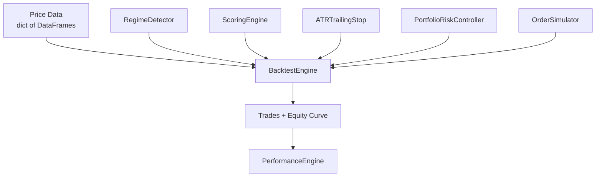
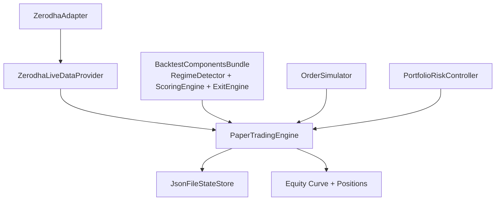
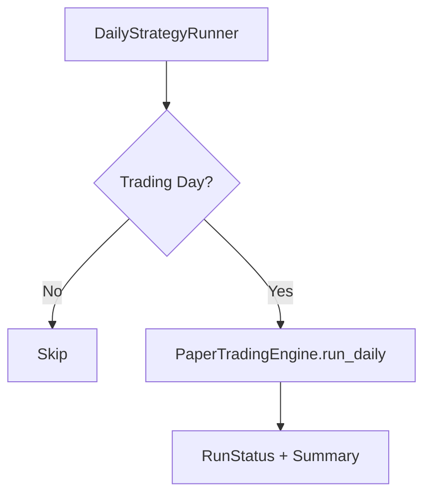

# System Architecture

This document describes the architecture of `ai_swing_trader`, focusing on the core building blocks, the application orchestration layer, and how data flows through backtesting and paper trading.

## Business Problems Addressed

- Systematize swing-trading decisions to reduce discretionary bias and improve repeatability.
- Rank and select trade candidates from a large universe using consistent technical and fundamental scoring.
- Detect market regime shifts and adjust allocations to protect capital during bearish conditions.
- Enforce risk controls such as position sizing, drawdown tracking, and circuit breakers.
- Simulate realistic trading costs and slippage for more accurate strategy evaluation.
- Backtest strategies with deterministic replay and measurable performance analytics.
- Run daily paper trading with persisted state to validate live-like behavior before deployment.
- Automate daily execution with calendar awareness and retry handling.

## High-Level View

The system is split into two main layers:

- `core/` provides reusable domain primitives: configuration loading, indicators, data access, regime detection, and scoring.
- `src/` orchestrates workflows: strategy signal scoring, portfolio allocation and rebalancing, risk controls, execution simulation, backtesting, paper trading, analytics, and automation.

## Repository Layout

- `core/` Domain primitives and utilities.
- `src/` Application services and orchestrators.
- `config/` YAML configuration.
- `infra/` Placeholder for infrastructure adapters (currently minimal).
- `tests/` Automated tests.
- `notebooks/` Research and experimentation.

## Core Domain Layer (`core/`)

Configuration

- `core/config/config_loader.py` loads and validates `config/strategy.yaml` into typed config objects.

Market Data

- `core/data/price_loader.py` reads parquet price history from `prices/{SYMBOL}.parquet`, with symbol-level LRU caching.
- `core/data/liquidity_filter.py` enforces a rolling turnover filter using price and volume data.

Strategy Building Blocks

- `core/analytics/indicators.py` provides SMA, RSI, ATR, and momentum.
- `core/strategy/scoring_engine.py` computes composite technical and fundamental scores.
- `core/strategy/regime_detector.py` determines market regime from index trend vs SMA.

Utilities

- `core/utils/time_utils.py` provides shared time helpers.

## Application Layer (`src/`)

Strategy and Signals

- `src/strategy/signal_engine.py` scores candidate universes by hybrid technical and fundamental signals.
- `src/regime/regime_engine.py` evaluates weekly regime state and maps to target allocations.

Portfolio and Risk

- `src/portfolio/allocator.py` selects top candidates and deploys capital with equal weights.
- `src/portfolio/rebalance_engine.py` plans monthly rebalances and determines entries/exits.
- `src/risk/trailing_stop.py` and `src/risk/trailing_stop_engine.py` implement ATR-based trailing stops.
- `src/risk/portfolio_risk.py` manages drawdown, circuit breaker, and position sizing.

Execution

- `src/execution/order_simulator.py` simulates fills with slippage and Zerodha fee modeling.

Backtesting

- `src/backtest/backtest_engine.py` runs deterministic daily simulation across data, regime, scoring, risk, and execution.

Paper Trading and Live Data

- `src/live/paper_trading_engine.py` runs daily paper trading with persisted state.
- `src/live/zerodha_data_provider.py` fetches live prices via a Zerodha adapter and normalizes data.

Broker Adapter

- `src/broker/zerodha_adapter.py` wraps Zerodha Kite APIs with paper-mode safety.

Analytics and Automation

- `src/analytics/performance_engine.py` computes performance, risk, and stability metrics.
- `src/automation/daily_runner.py` schedules and retries daily paper trading runs.

## Configuration

`config/strategy.yaml` provides the key runtime knobs:

- `score_threshold`
- `max_positions`
- `rebalance_frequency`
- `atr_multiple`
- `bear_allocation`
- `liquidity.min_avg_turnover`

These values are validated and exposed via `core/config/config_loader.py`.

## Data Flow

Backtest Flow

Paper Trading Flow

Daily Automation Flow

## Persistence and State

- Paper trading state is stored via `JsonFileStateStore` in `src/live/paper_trading_engine.py`.
- State includes capital, open positions, equity curve, and last rebalance date.

## Extension Points

These interfaces make the system adaptable without changing core logic:

- `FundamentalDataProvider` protocol in `core/strategy/scoring_engine.py`
- `SymbolMapper` protocol in `src/live/zerodha_data_provider.py`
- `StateStore` protocol in `src/live/paper_trading_engine.py`
- `CalendarProvider` protocol in `src/automation/daily_runner.py`

## Key Design Properties

- Deterministic logic for backtests and paper trading.
- Explicit configuration validation and typed config objects.
- Separation between core domain logic and application orchestration.
- Clear adapters for broker and data provider integration.
